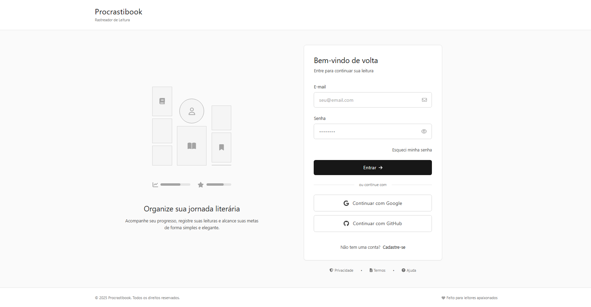
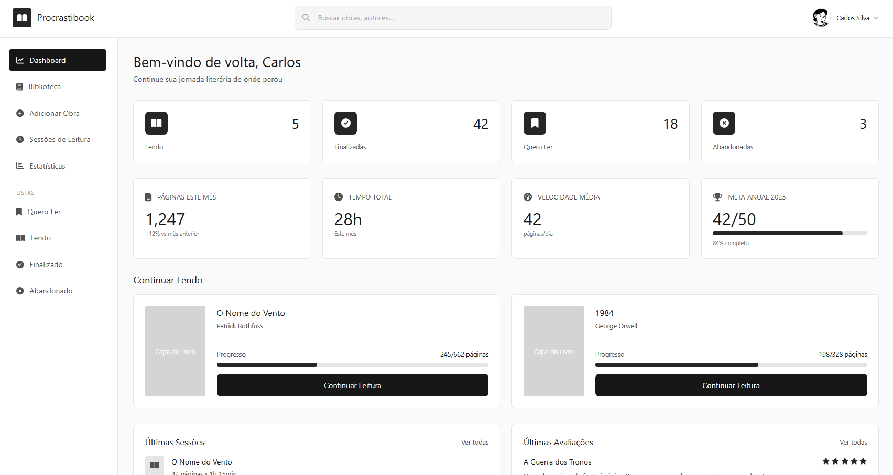
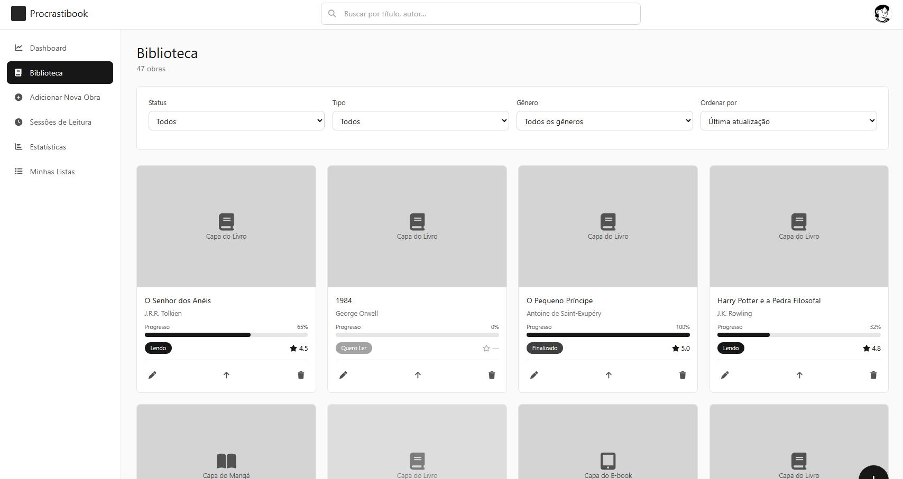
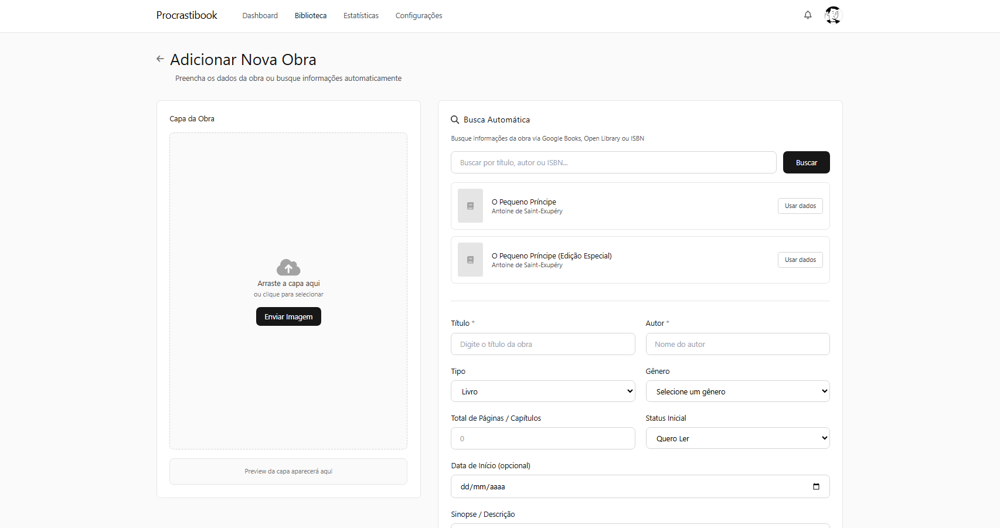

# CSI606-2026-01 - Proposta trabalho final


## Aluno: Carlos Gabriel de Oliveira Frazão - 22.1.8100

---

## Resumo

O presente trabalho propõe o desenvolvimento de uma aplicação web voltada para o gerenciamento e acompanhamento de hábitos de leitura de diferentes tipos de obras, como livros, mangás, artigos e e-books.

A plataforma permitirá que usuários organizem suas leituras de forma simples e centralizada, registrando progresso, sessões de leitura, avaliações, anotações e listas personalizadas. Além disso, o sistema contará com dashboards e estatísticas para auxiliar no acompanhamento do desempenho e dos hábitos de leitura ao longo do tempo.

O projeto tem como foco a aplicação de conceitos de desenvolvimento web full stack utilizando tecnologias modernas tanto no frontend quanto no backend, além da integração com APIs externas para enriquecimento automático das informações das obras cadastradas.

---

# 1. Tema

O trabalho final tem como tema o desenvolvimento de um sistema web para gerenciamento e acompanhamento de hábitos de leitura.

A aplicação será voltada para usuários que desejam centralizar informações relacionadas às suas leituras em um único ambiente, permitindo organizar obras, acompanhar progresso, registrar sessões de leitura e visualizar estatísticas pessoais.

---

# 2. Escopo

O sistema contará com as seguintes funcionalidades principais:

- Cadastro e gerenciamento de obras:
    - Livros;
    - Mangás;
    - Artigos;
    - E-books.

- Controle de progresso de leitura:
    - Páginas lidas;
    - Porcentagem concluída;
    - Controle de capítulos.

- Registro de sessões de leitura:
    - Tempo gasto;
    - Quantidade de páginas lidas;
    - Anotações pessoais.

- Sistema de avaliações e reviews:
    - Notas;
    - Comentários;
    - Citações favoritas.

- Organização por listas personalizadas:
    - Quero Ler;
    - Lendo;
    - Finalizado;
    - Abandonado.

- Dashboard com estatísticas pessoais:
    - Quantidade de obras lidas;
    - Total de páginas;
    - Velocidade média de leitura;
    - Metas de leitura.

- Sistema de busca e filtros:
    - Título;
    - Autor;
    - Gênero;
    - Status da leitura.

- Integração com APIs externas:
    - Google Books API;
    - Open Library API.

---

# 3. Restrições

Neste trabalho não serão considerados:

- Recursos de rede social entre usuários;
- Sistema de mensagens ou chat em tempo real;
- Marketplace ou compra de livros;
- Aplicativo mobile nativo;
- Recomendações baseadas em inteligência artificial;
- Funcionalidades offline;
- Sistema avançado de autenticação com múltiplos fatores.
---

# 4. Protótipo

Os esboços da interface do sistema foram elaborados na forma de protótipos de baixa fidelidade, servindo para ilustrar o fluxo de navegação principal e a disposição inicial dos componentes de tela. Os arquivos de imagem correspondentes encontram-se estruturados na pasta `prototipos`:

### Tela de Login
Interface simples contendo campos para autenticação do usuário na plataforma.


### Dashboard
Painel central contendo as métricas de leitura, metas anuais, etc.


### Biblioteca
Visualização de todas as obras cadastradas pelo usuário, separadas por categorias e progresso.


### Adicionar Obra
Formulário para inclusão manual de novos materiais ou para importação automatizada via APIs externas.

---

# 5. Tecnologias Previstas

## Frontend
- HTML;
- CSS;
- JavaScript;
- React.

## Backend
- Java;
- Spring Boot.

## Banco de Dados
- PostgreSQL ou Oracle.

## Outras Tecnologias
- Google Books API;
- Open Library API.

---

# 6. Estrutura de Pastas Prevista

Como o projeto encontra-se atualmente na fase de proposta, o repositório contém inicialmente apenas a documentação. A estrutura de diretórios planejada para a implementação da aplicação é a seguinte:
```text
📦 procrastibook
 ┣ 📂 backend             # Lógica de negócios e API REST (Java + Spring Boot)
 ┣ 📂 frontend            # Interface web (React)
 ┣ 📂 prototipos          # Arquivos de imagem dos protótipos de baixa fidelidade (provavelmente substituído pelos protótipos de alta no futuro)
 ┣ 📜 docker-compose.yml  # Configuração para conteinerização do ambiente (DB, etc.)
 ┗ 📜 README.md           # Documentação e informações principais do projeto
```
---

# 7. Referências


GOOGLE BOOKS API. Google Books APIs Getting Started. Disponível em: <https://developers.google.com/books>. Acesso em: 15 maio 2026.

JAVA. Java Platform, Standard Edition Documentation. Disponível em: <https://docs.oracle.com/en/java/>. Acesso em: 15 maio 2026.

OPEN LIBRARY API. Open Library Developer Center. Disponível em: <https://openlibrary.org/developers/api>. Acesso em: 15 maio 2026.

POSTGRESQL. PostgreSQL Database Management System Documentation. Disponível em: <https://www.postgresql.org/docs/>. Acesso em: 15 maio 2026.

REACT. React Documentation and Guides. Disponível em: <https://react.dev>. Acesso em: 15 maio 2026.

SPRING. Spring Boot Reference Documentation. Disponível em: <https://docs.spring.io/spring-boot/docs/>. Acesso em: 15 maio 2026.
